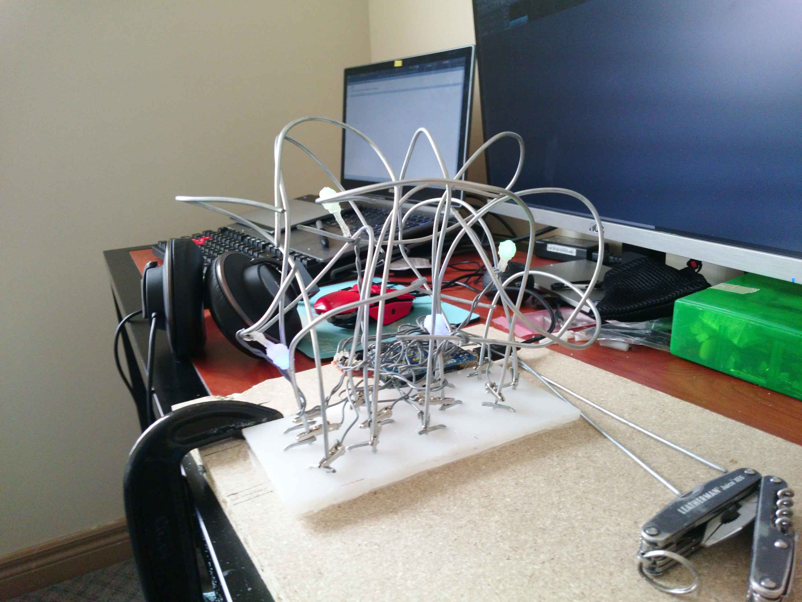
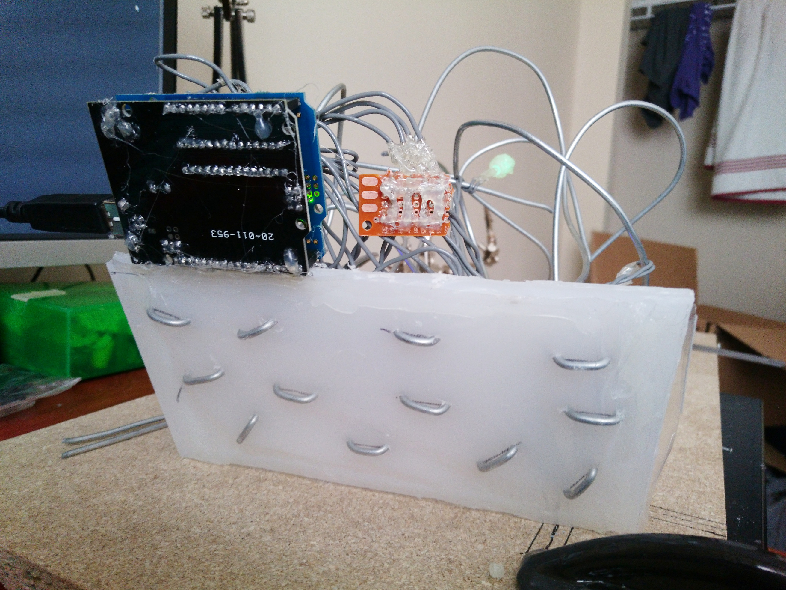
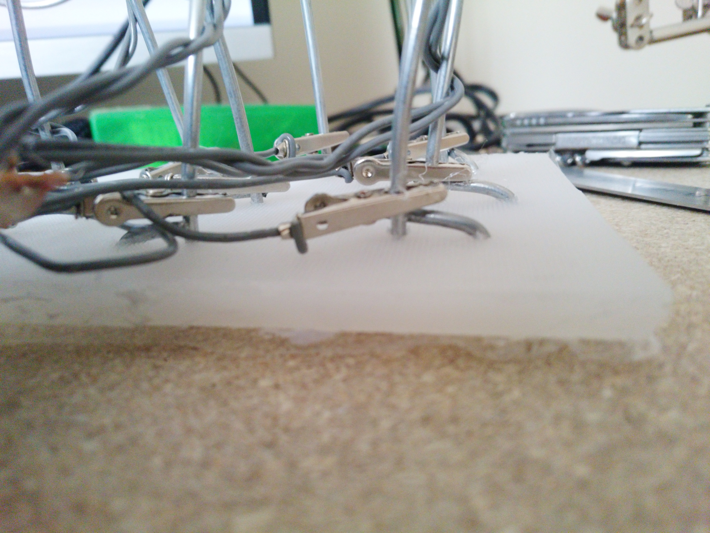
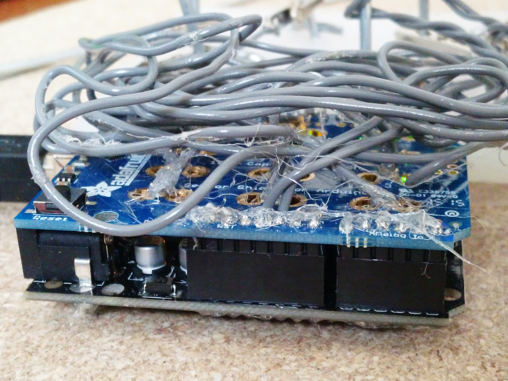
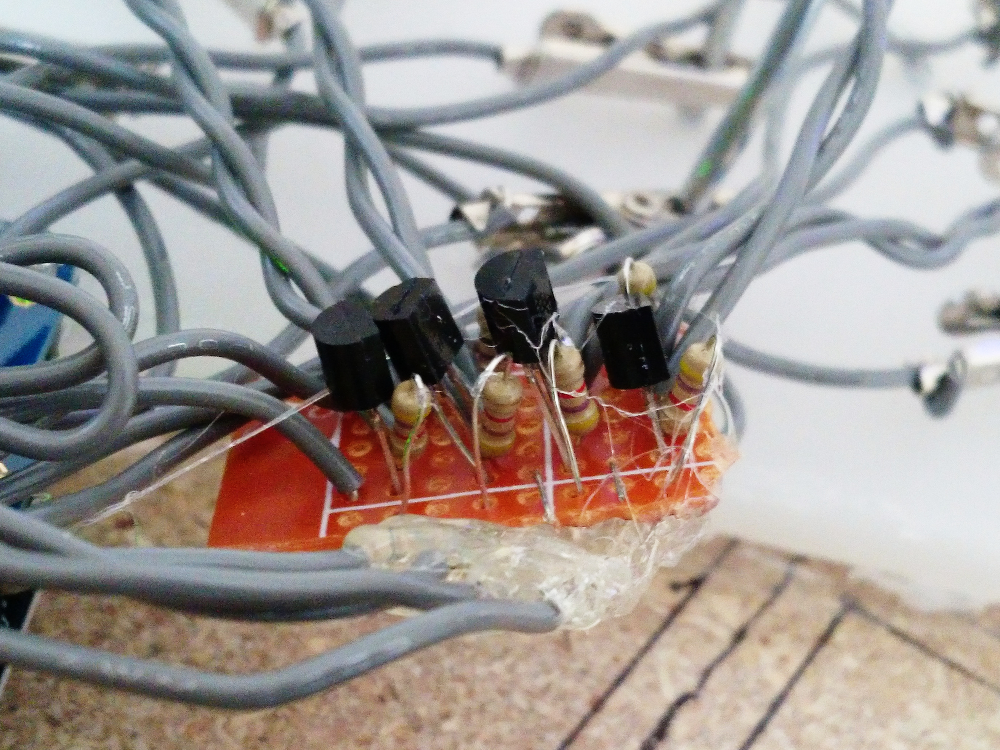
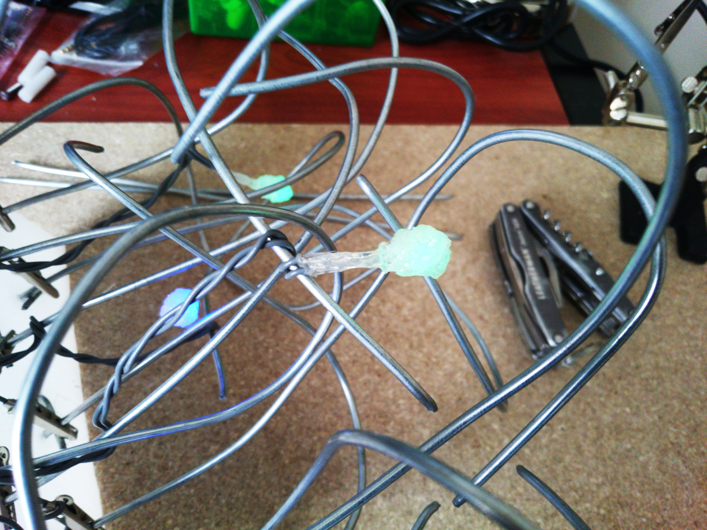

Ananaphone
==========
The least ergonomic MIDI keyboard ever invented.

Touch the metal bits to play sounds! The LEDs pulse and react to your actions.

# [VIDEO DEMO](https://www.youtube.com/watch?v=Nx6oU0oYaCI)

Physical Setup
--------------

The base is a piece of Delrin about 10cm by 20cm - I used about half of an old cutting board. The metal sticking-up bits are lengths of 12 guage galvanized steel gardening wire, available from most hardware stores:

I started off by drilling 3/32" holes (that's 2.38mm in real units) where the wire should stick up, then for each hole, drilling another one 1.5cm away from it. The gardening wire was threaded through each hole, then bent back through the corresponding hole spaced 1.5cm away, using locking pliers. Bending it back in on itself, the gardening wire is securely attached to the base. Afterward, the gardening wire was bent and twisted until it was no longer ergonomic. I glued a transparent plastic sheet to the bottom of the whole thing to prevent the gardening wires from shorting together if placed on a conductive surface.

The gardening wire is electrically connected using alligator clips crimped to 22AWG copper wire:

In hindsight, the copper wires were way too long and resulted in a rat's nest of wires above the Arduino. However, this does make it pretty easy to rearrange the connection layout afterward.

The other ends of each wire are soldered to the touch terminals of the [Adafruit MPR121 12-channel capacitive touch shield](https://www.adafruit.com/products/2024) on top of the [Arduino Uno](https://www.arduino.cc/en/Main/arduinoBoardUno):

That's all that's needed for the touch sensing! The touch shield conveniently includes through-hole soldering connection points for attaching the wires, and it is mechanically very robust.

For the lights, I made a 4-channel low-side switch with 2N2222 NPN transistors and a few resistors:

This board was needed because the I/O pins on the Arduino can't handle the ~50mA each LED draws. Instead, each pin simply switches the transistor.

The amplifier board has 6 inputs (power, ground, and 4 signal lines that are connected to Arduino PWM outputs) and is connected directly to 4 LEDs.

Kneading the hot glue as it's cooling reulted in a nice "organic" effect that also made it diffuse light better. I love hot glue. The lights are wound around various parts of the gardening wire structure.

Software
--------

The Arduino is running a pretty short sketch that simply sends touch data (retrieved using the excellent [Adafruit MPR121 library](https://github.com/adafruit/Adafruit_MPR121_Library)) to the computer over serial, and controls the LED brightnesses. The sketch source code can be found under the `arduino/Touch` directory.

The touch data is sent as strings of base-10 numbers, one per line, such that, when converted into a 12-bit binary number, each binary digit represents the touch state of one of the 12 channels (the least significant bit represents channel 0, and the most significant bit represents channel 11). For example, a line containing `7` means that channel 0, 1, and 2 have detected touches, and no others. Touch data is sent when one or more untouched channels are touched, or one or more touched channels are no longer touched.

On the computer side, there's a few Python scripts that interface with the Arduino using [PySerial](http://pyserial.sourceforge.net/):

* `anana-samples.py` uses [PyGame](http://www.pygame.org/hifi.html) to play WAV samples in `sounds/` when any of the channels are touched.
* `anana-midi.py` uses [PyGame](http://www.pygame.org/hifi.html) to send MIDI messages, which can then be interpreted by software such as [LMMS](https://lmms.io/) or [Ableton Live](https://www.ableton.com/).

To use these scripts:

1. Make sure you have the dependencies (Python 3.4+, PySerial 2.7+ and PyGame 1.9+) - on Debian/Ubuntu, these can be installed simply by running `setup.sh`.
2. It may be necessary to configure the scripts. For example, the `SERIAL_PORT` and the `MIDI_OUTPUT` variables will often depend on your system configuration. The `SERIAL_PORT` variable should be a string like `COM5` (for Windows) or `/dev/ttyACM0` (for POSIX), and the MIDI_OUTPUT variable should be a non-negative integer representing the MIDI output device index to use.
3. Plug in the Arduino.
4. Wait for the LED bulbs to come on, then start one of the `anana-*.py` scripts.
5. Touch the metal bits!
